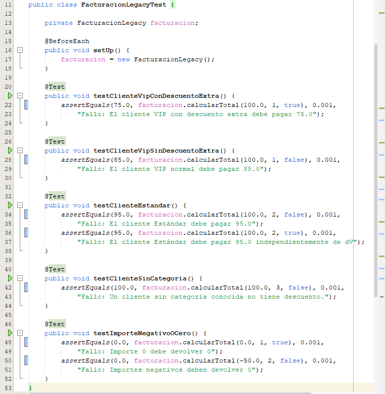

# REFACTORIZACIÓN LEGACY ALEJANDRO MORENO Y PABLO GARCIA
Antes de empezar hemos investigado usando páginas web y en videos como iniciar un repositorio compartido en github para que
pudiesemos hacer commits desde netBeans. y que se sincronizaran con github automáticamente.
Tras varios errores mientras pablo y yo actuábamos como copiloto y piloto a la vez a las 14:00h hemos conseguido solucionar todo y pablo acaba de comenzar sus 30 min de refactorización.

## Fase 1: Análisis de la Deuda Técnica

Como la propia tarea indica, hemos encontrado en el método grandes problemas. Nombre de las variables que sin contexto no sabemos que es, codigo spaguetti o números mágicos.

## Fase 2: Refactorización Asistida por el IDE 
Nuestra refactorizacion cumple la regla de M=C+1 ya que solo usamos 4 condiconales de los 4 que se recomiendan como maximo y nuestra Complejidad diplomática es de 4.

## Fase 3: Verificación, Documentación y Entrega
